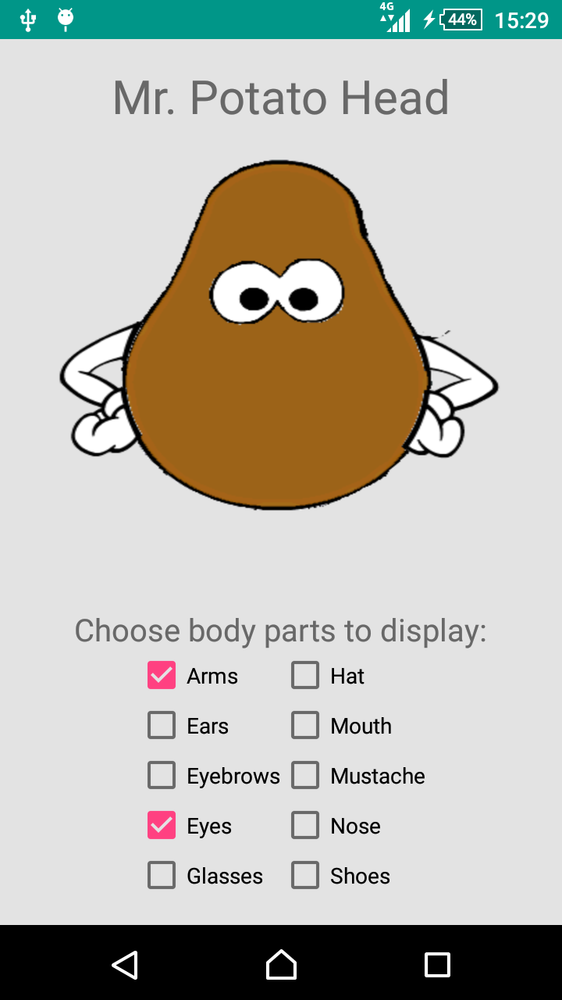
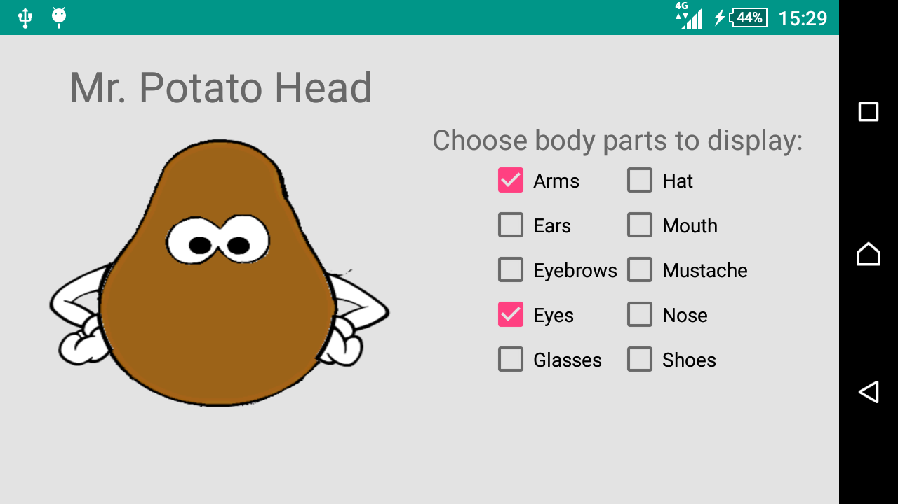

# Native App Studio: Mr. Potatohead

In this app it is possible to dress a potato by checking the checkboxes of the body parts and accessories to display. There are seperate layouts for each screen orientation. In portrait mode the checkboxes are positioned below the potato at the bottom of the display. In landscape mode the potato and checkboxes are positioned side-by-side. The displayed body parts and acessories are stored so that the user does not have to reselect them when the app is restarted to get their favourite potato.

### Screenshots

